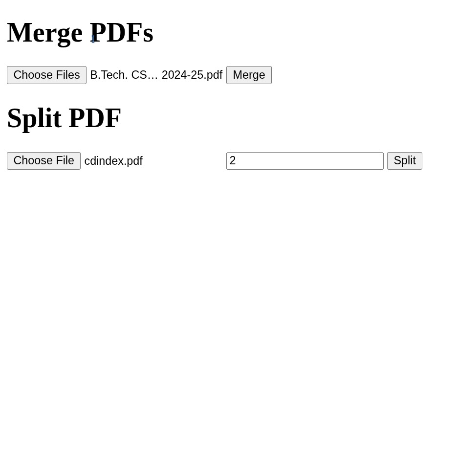

# PDF Merge & Split Java Web App

This project is a simple Java-based web application that allows users to:
- **Merge multiple PDF files into one.**
- **Split a single PDF at a specified page.**

## Features



### ✅ Merge PDFs
- Upload multiple PDF files.
- Merge them into a single PDF document.

### ✂️ Split PDF
- Upload a PDF.
- Enter the page number where you want to split it.
- Get two PDF files as output.

## Technologies Used

- **Java (Servlets)**
- **Apache PDFBox** for handling PDF operations.
- **HTML/CSS** for basic UI.

## Setup Instructions
### Clone or download the repository

- Add Apache PDFBox to your lib/ folder

- Download from: https://pdfbox.apache.org/

- Place the JAR file inside lib/.

- Compile and run the project using a servlet container

- Example: **Apache Tomcat**

## Access the application

- Navigate to: ```http://localhost:8080/pdf-tool/```

## Usage
### Merge PDFs

- Go to the "Merge PDFs" section.

- Click "Choose Files" and select multiple PDF files.

- Click "Merge" to download the combined PDF.

## Split a PDF

- Go to the "Split PDF" section.

- Choose a PDF file.

- Enter the page number where you want to split.

- Click "Split" to download the resulting PDFs.
